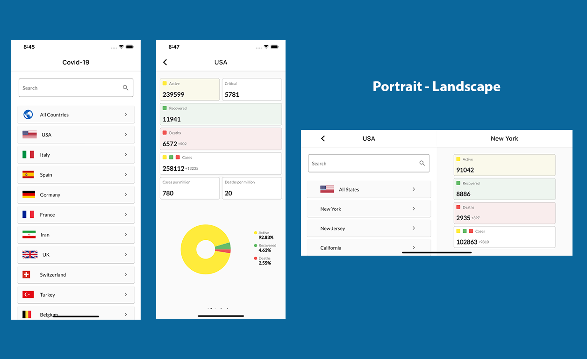

  

# Covid-19 Stats

Covid-19 stats around the world.

- USA stats by single states
- Italy stats by single regions

## Flutter web

to buid use:

flutter build web --dart-define=FLUTTER_WEB_USE_SKIA=true

## License

MIT License - see the [LICENSE](LICENSE)

## Inspired from

* [CovidUpdates](https://github.com/ashishkhuraishy/CovidUpdates) - by Ashish
* [Covid19Stats](https://github.com/GabrielTavernini/Covid19Stats) - by Gabriel Tavernini

## Credits

* [COVID-19](https://github.com/pcm-dpc/COVID-19) - Italy stats
* [NovelCOVID/API](https://github.com/NovelCOVID/API) - other countries stats

